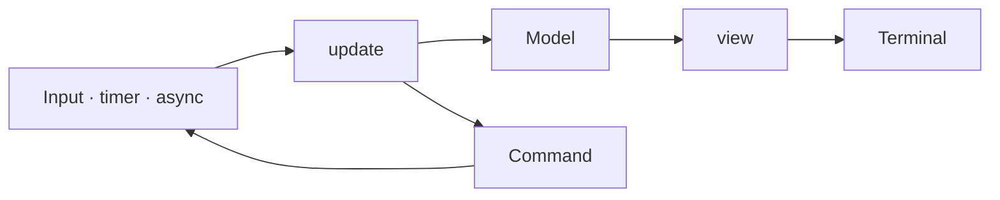

<div align="center">
  <h1>ZigZag</h1>

  <p>A batteries-included TUI framework for Zig.</p>

  <p>
    <a href="https://github.com/meszmate/zigzag/actions"></a>
    <a href="https://github.com/meszmate/zigzag/releases"></a>
    <a href="./LICENSE"></a>
    
  </p>

  <p>
    <a href="#features">Features</a> ·
    <a href="#how-it-works">How it works</a> ·
    <a href="#quick-start">Quick start</a> ·
    <a href="#components">Components</a> ·
    <a href="#examples">Examples</a> ·
    <a href="REFERENCE.md">Reference</a>
  </p>

  
</div>

ZigZag brings typed Model-Update-View applications, rich styling, flexible
layout, and 40+ components to the terminal with no third-party dependencies.

## Features

| Capability | Highlights |
|------------|------------|
| **Architecture** | Typed Model-Update-View, commands, async tasks, sub-programs |
| **Components** | 40+ inputs, tables, lists, charts, forms, and overlays |
| **Styling** | ANSI, 256-color, TrueColor, adaptive themes, borders, and text overflow |
| **Layout** | Placement, Flexbox constraints, split panes, and layered composition |
| **Terminal support** | Keyboard, mouse, clipboard, images, suspend/resume |
| **Performance** | Diff rendering, ANSI compression, and virtual lists |

## How it works

Events update the model, then `view` renders the next terminal frame.



## Quick start

Requires Zig 0.16.0 or newer.

```sh
zig fetch --save git+https://github.com/meszmate/zigzag#main
```

```zig
const zigzag = b.dependency("zigzag", .{
    .target = target,
    .optimize = optimize,
});

exe.root_module.addImport("zigzag", zigzag.module("zigzag"));
```

Start with the [counter example](examples/counter.zig).

## Components

| Category | Includes |
|----------|----------|
| **Input** | Text input, text area, forms, pickers |
| **Data** | Lists, tables, trees, navigation |
| **Visuals** | Charts, gauges, heatmaps, canvases |
| **Feedback** | Modals, toasts, tooltips, menus |
| **Tooling** | Markdown, code view, diff view, logs |

[Browse the component index →](REFERENCE.md#components)

## Examples

| Demo | Run |
|------|-----|
| [Showcase](examples/showcase.zig) | `zig build run-showcase` |
| [Dashboard](examples/dashboard.zig) | `zig build run-dashboard` |
| [File browser](examples/file_browser.zig) | `zig build run-file_browser` |
| [WebAssembly](examples/wasm_app.zig) | `zig build run-wasm_app` |

[See every example →](examples/)

## Documentation

[Reference](REFERENCE.md) · [Examples](examples/) ·
[Contributing](CONTRIBUTING.md)

## Star ZigZag ⭐

If ZigZag is useful to you, [star the repository](https://github.com/meszmate/zigzag).

## License

[MIT](LICENSE)
